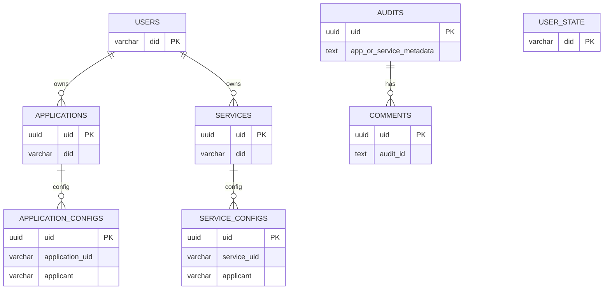

# 数据表结构（核心）

本节基于 `src/domain/mapper/entity.ts` 的 TypeORM 定义，描述主要数据表结构。

> 字段类型与数据库实际类型可能有细微差异，请以迁移/实际建表为准。

## ER 图（概览）

## users
| 字段 | 类型 | 说明 |
| --- | --- | --- |
| did | varchar(128) PK | 用户 DID |
| name | varchar(128) | 昵称 |
| avatar | text | 头像 |
| created_at | varchar(64) | 创建时间 |
| updated_at | varchar(64) | 更新时间 |
| signature | varchar(192) | 签名（当前未校验） |

## user_state
| 字段 | 类型 | 说明 |
| --- | --- | --- |
| did | varchar(128) PK | 用户 DID |
| role | varchar(64) | 角色 |
| status | varchar(64) | 状态 |
| created_at | varchar(64) | 创建时间 |
| updated_at | varchar(64) | 更新时间 |
| signature | varchar(192) | 签名（当前未校验） |

## services
| 字段 | 类型 | 说明 |
| --- | --- | --- |
| uid | uuid PK | 服务主键 |
| did | varchar(128) | 服务 DID |
| version | int | 版本 |
| owner | varchar(128) | 所有者 DID |
| owner_name | varchar(128) | 所有者名称 |
| network | varchar(64) | 网络 |
| address | varchar(128) | 地址 |
| name | varchar(64) | 名称 |
| description | text | 描述 |
| code | varchar(64) | 服务编码 |
| api_codes | text | API 编码列表（逗号分隔） |
| proxy | varchar(256) | 代理地址 |
| grpc | varchar(256) | gRPC 地址 |
| avatar | text | 头像 |
| created_at | varchar(64) | 创建时间 |
| updated_at | varchar(64) | 更新时间 |
| signature | varchar(192) | 签名（当前未校验） |
| code_package_path | text | 包路径 |
| status | varchar(64) | 业务状态（BUSINESS_STATUS_*） |
| is_online | boolean | 上架标记 |

## applications
| 字段 | 类型 | 说明 |
| --- | --- | --- |
| uid | uuid PK | 应用主键 |
| did | varchar(128) | 应用 DID |
| version | int | 版本 |
| owner | varchar(128) | 所有者 DID |
| owner_name | varchar(128) | 所有者名称 |
| network | varchar(64) | 网络 |
| address | varchar(128) | 地址 |
| name | varchar(64) | 名称 |
| description | text | 描述 |
| code | varchar(64) | 应用编码 |
| location | text | 应用位置/入口 |
| service_codes | text | 依赖服务编码（逗号分隔） |
| avatar | text | 头像 |
| created_at | varchar(64) | 创建时间 |
| updated_at | varchar(64) | 更新时间 |
| signature | varchar(192) | 签名（当前未校验） |
| code_package_path | text | 包路径 |
| status | varchar(64) | 业务状态（BUSINESS_STATUS_*） |
| is_online | boolean | 上架标记 |

## service_configs
| 字段 | 类型 | 说明 |
| --- | --- | --- |
| uid | uuid PK | 配置主键 |
| service_uid | varchar(64) | 服务 UID |
| service_did | varchar(128) | 服务 DID |
| service_version | int | 服务版本 |
| applicant | varchar(128) | 申请人地址 |
| config_json | text | 配置 JSON（code/instance 列表） |
| created_at | varchar(64) | 创建时间 |
| updated_at | varchar(64) | 更新时间 |

## application_configs
| 字段 | 类型 | 说明 |
| --- | --- | --- |
| uid | uuid PK | 配置主键 |
| application_uid | varchar(64) | 应用 UID |
| application_did | varchar(128) | 应用 DID |
| application_version | int | 应用版本 |
| applicant | varchar(128) | 申请人地址 |
| config_json | text | 配置 JSON（code/instance 列表） |
| created_at | varchar(64) | 创建时间 |
| updated_at | varchar(64) | 更新时间 |

## audits
| 字段 | 类型 | 说明 |
| --- | --- | --- |
| uid | uuid PK | 工单主键 |
| app_or_service_metadata | text | 申请对象元数据 JSON |
| audit_type | text | 审批类型（application/service） |
| applicant | text | 申请人（did::name） |
| approver | text | 审核策略（JSON 对象或列表）；对象形如 `{ "approvers": [...], "requiredApprovals": 2 }` |
| reason | text | 申请原因 |
| created_at | timestamp | 创建时间 |
| updated_at | timestamp | 更新时间 |
| signature | varchar(192) | 签名（当前未校验） |
| target_type | varchar(32) | 目标类型（application/service） |
| target_did | varchar(128) | 目标 DID |
| target_version | int | 目标版本 |
| target_name | varchar(128) | 目标名称 |

## comments
| 字段 | 类型 | 说明 |
| --- | --- | --- |
| uid | uuid PK | 评论主键 |
| audit_id | text | 关联 audits.uid |
| text | text | 审批意见 |
| status | text | 审批状态（COMMENT_STATUS_AGREE / COMMENT_STATUS_REJECT） |
| created_at | varchar(64) | 创建时间 |
| updated_at | varchar(64) | 更新时间 |
| signature | varchar(192) | 签名（当前未校验） |

## mpc_sessions
| 字段 | 类型 | 说明 |
| --- | --- | --- |
| id | varchar(64) PK | 会话 ID |
| type | varchar(16) | keygen/sign/refresh |
| wallet_id | varchar(128) | 钱包 ID |
| threshold | int | 门限 |
| participants | text | 参与者列表 JSON |
| status | varchar(32) | 会话状态 |
| round | int | 当前轮次 |
| curve | varchar(32) | 曲线 |
| key_version | int | 公钥版本 |
| share_version | int | share 版本 |
| created_at | varchar(64) | 创建时间（epoch ms） |
| expires_at | varchar(64) | 过期时间（epoch ms） |

## mpc_session_participants
| 字段 | 类型 | 说明 |
| --- | --- | --- |
| uid | uuid PK | 参与者主键 |
| session_id | varchar(64) | 会话 ID |
| participant_id | varchar(64) | 成员 ID |
| device_id | varchar(128) | 设备指纹 |
| identity | varchar(256) | 身份（did） |
| e2e_public_key | text | E2E 公钥 |
| signing_public_key | text | 签名公钥 |
| status | varchar(32) | 状态 |
| joined_at | varchar(64) | 加入时间（epoch ms） |

## mpc_messages
| 字段 | 类型 | 说明 |
| --- | --- | --- |
| id | varchar(64) PK | 消息 ID |
| session_id | varchar(64) | 会话 ID |
| sender | varchar(64) | 发送方 |
| receiver | varchar(64) | 接收方（可空） |
| round | int | 轮次 |
| type | varchar(64) | 消息类型 |
| seq | int | 序号 |
| envelope | text | 加密信封 JSON |
| created_at | varchar(64) | 创建时间（epoch ms） |

## mpc_sign_requests
| 字段 | 类型 | 说明 |
| --- | --- | --- |
| id | varchar(64) PK | 请求 ID |
| wallet_id | varchar(128) | 钱包 ID |
| session_id | varchar(64) | 会话 ID |
| initiator | varchar(64) | 发起人 |
| payload_type | varchar(32) | 负载类型 |
| payload_hash | varchar(256) | 负载哈希 |
| chain_id | int | 链 ID |
| status | varchar(32) | 状态 |
| approvals | text | 审批列表 JSON |
| created_at | varchar(64) | 创建时间（epoch ms） |

## mpc_audit_logs
| 字段 | 类型 | 说明 |
| --- | --- | --- |
| id | varchar(64) PK | 日志 ID |
| wallet_id | varchar(128) | 钱包 ID |
| session_id | varchar(64) | 会话 ID |
| level | varchar(16) | 级别 |
| action | varchar(64) | 动作 |
| actor | varchar(64) | 操作人 |
| message | text | 描述 |
| time | varchar(64) | 时间（epoch ms） |
| metadata | text | 元数据 JSON |
